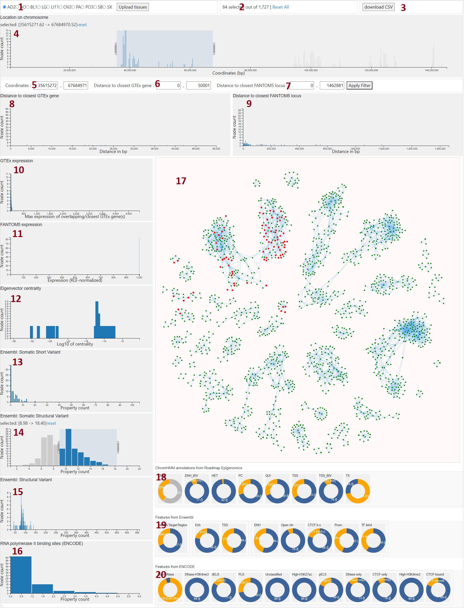
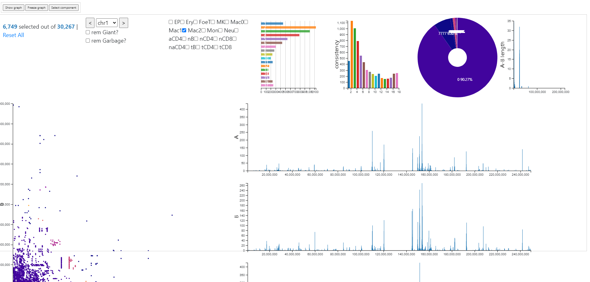

# Visualizations Directory
Here are several tools that can be used to explore the Hi-C data.
## BioClique Visualization
An interactive Hi-C network visualization with extra biological data assigned to nodes from different external databases like ENCODE and Ensembl. 

## Clique-3 Visualization
It is a tool to explore sizes and locations of cliques. 

## Component Visualization
A visualisation for exploration of tissue specific connected components of Hi-C networks.

